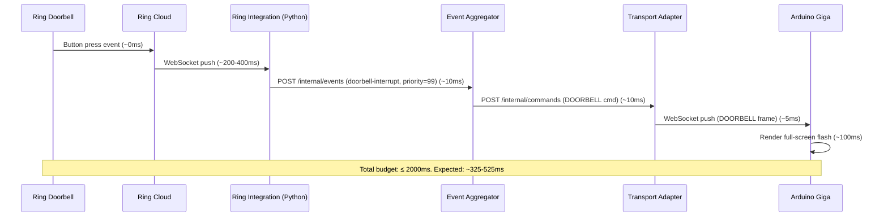
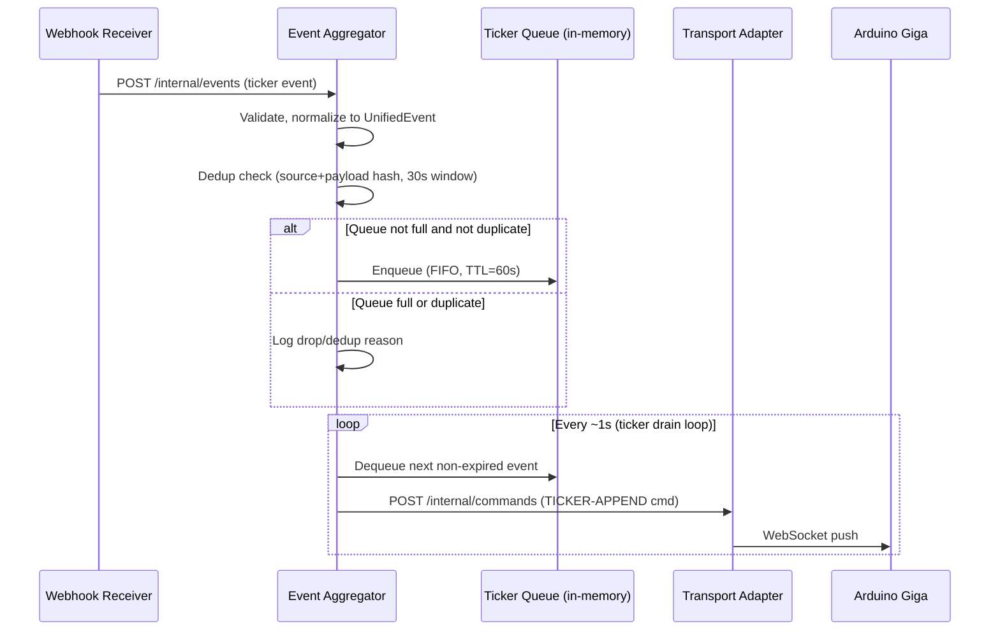
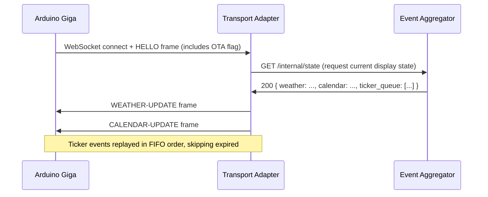
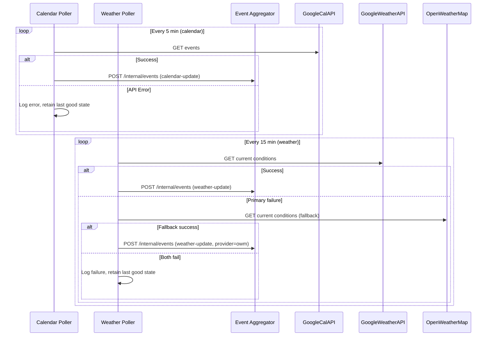

# HousePanel — Technical Design

_Gate 3 artifact. Created: 2026-05-16. Owner: karl@wehden.com._
_Source of truth: `spec/context.md` (Gate 1), `spec/requirements.md` (Gate 2)._

---

## Overview

HousePanel is a six-component backend system running on the `laminarflow` Kubernetes cluster that aggregates home automation data and drives an always-on physical display panel built on the Arduino Giga + Gigashield. The backend collects events from four independent sources (Ring doorbell, UniFi Protect camera service, ArduinoTempHumUbuntu, Google Calendar, and Google Weather), normalizes them into a single internal event type, and pushes rendered commands to the Giga over a persistent WebSocket connection.

The key design invariant is that doorbell events are always routed as highest-priority interrupts and bypass the ticker queue entirely, reaching the display in under 2 seconds end-to-end. All other events — camera narratives, system alerts, weather updates, and calendar updates — flow through the aggregator before reaching the display.

**Open questions resolved by this design:**

| OQ | Resolution |
|----|-----------|
| OQ1 | **python-ring-doorbell** (Python, `listen` extra). Personal-use path (Path B) chosen over official Ring Developer Platform (Path A) — certification overhead disproportionate for a personal deployment. `python-ring-doorbell` chosen over `ring-client-api` (Node.js) for Python stack consistency. See Alternatives Considered for full evaluation. |
| OQ2 | WebSocket server on K8s side (Arduino Transport Adapter); Giga connects as a WebSocket client on startup and holds the connection. K8s pushes commands. **Firmware WebSocket library: `ArduinoHttpClient` (official Arduino lib, MbedOS-compatible); `arduinoWebSockets` as fallback.** |
| OQ3 | **Confirmed by discovery.** ardconfig is a host-side dev environment bootstrap (installs arduino-cli, udev, cores on Ubuntu) — it provides no firmware code. HousePanel firmware calls `WiFi.begin()` directly using `WiFi.h` from the `arduino:mbed_giga` core. |
| OQ5 | Calendar default polling interval: 5 minutes (env `CALENDAR_POLL_INTERVAL_SECONDS`, default `300`). Weather default polling interval: 15 minutes (env `WEATHER_POLL_INTERVAL_SECONDS`, default `900`). |
| OQ6 | Doorbell interrupt auto-dismisses after 30 seconds with no manual acknowledgement required for v1 (env `DOORBELL_TIMEOUT_SECONDS`, default `30`). |
| OQ7 | FIFO queue, max depth 20 events (env `TICKER_QUEUE_MAX_DEPTH`, default `20`), 60-second TTL per event (env `TICKER_EVENT_TTL_SECONDS`, default `60`), deduplication by SHA-256(source + payload) within a 30-second window (env `TICKER_DEDUP_WINDOW_SECONDS`, default `30`). |
| OQ8 | ArduinoTempHumUbuntu inbound schema defined in this document (see Data Model section). HousePanel owns the contract; sibling repo implements against it. |
| OQ9 | HMAC-SHA256 shared secret on `X-HousePanel-Signature` header. Shared secrets stored in K8s Secrets, one per webhook source. |

---

## Architecture

### Component Responsibilities

| Component | Language/Runtime | Role |
|-----------|-----------------|------|
| Webhook Receiver | Python 3.12 / FastAPI | Accepts inbound HTTP POST payloads from UniFi Protect and ArduinoTempHumUbuntu, validates HMAC signatures, validates schema, forwards to Aggregator. |
| Event Aggregator | Python 3.12 / FastAPI | Normalizes all events into `UnifiedEvent`; maintains the FIFO ticker queue; routes doorbell interrupts immediately; sends commands to Transport Adapter. |
| Calendar Poller | Python 3.12 / APScheduler | Polls Google Calendar API on schedule; pushes `calendar-update` events to Aggregator. |
| Weather Poller | Python 3.12 / APScheduler | Polls Google Weather API (primary) or OpenWeatherMap (fallback) via swappable adapter; pushes `weather-update` events to Aggregator. |
| Ring Integration Backend | Python 3.12 / python-ring-doorbell | Subscribes to Ring doorbell ding events via `listen` extra; normalizes and pushes `doorbell-interrupt` events to Aggregator. |
| Arduino Transport Adapter | Python 3.12 / FastAPI + websockets | WebSocket server; the Giga connects as client. Receives commands from Aggregator and pushes them over the WebSocket connection. Handles OTA pause protocol. |

### ASCII Component Diagram

```
External Sources                  laminarflow K8s Cluster                      Hardware
─────────────────    ───────────────────────────────────────────────────    ───────────
                     ┌──────────────────┐
UniFi Protect ──────►│ Webhook Receiver │
                     │  :8000           │
ArduinoTempHum ─────►│  POST /v1/webhooks│◄── HMAC auth
                     └────────┬─────────┘
                              │ POST /internal/events
                              ▼
Ring Cloud ──────┐   ┌────────────────────┐
                 │   │  Event Aggregator  │◄── Calendar Poller
Ring Integration─┘──►│  :8001             │◄── Weather Poller
Backend (Node.js)    │  ticker queue      │
                     │  priority router   │
                     └────────┬───────────┘
                              │ POST /internal/commands
                              ▼
                     ┌────────────────────┐
                     │  Transport Adapter │
                     │  :8002  WS /ws/panel│
                     └────────┬───────────┘
                              │ WebSocket (push)
                              ▼
                     ┌────────────────────┐
                     │  Arduino Giga      │
                     │  + Gigashield      │
                     │  (ardconfig OTA)   │
                     └────────────────────┘

K8s Services (ClusterIP unless noted):
  webhook-receiver  → NodePort/Ingress (external-facing)
  aggregator        → ClusterIP
  calendar-poller   → no Service (outbound only)
  weather-poller    → no Service (outbound only)
  ring-integration  → no Service (outbound only)
  transport-adapter → ClusterIP
```

---

## Data Flow

### Doorbell Interrupt Path (latency-critical)



**Latency budget allocation:**

| Leg | Expected | Worst-case budget |
|-----|----------|------------------|
| Ring press → Ring cloud WebSocket delivery | 200–400 ms | 800 ms |
| Ring cloud → ring-integration service | 0 ms (same message) | — |
| Ring integration → Aggregator HTTP | 10 ms | 50 ms |
| Aggregator processing + routing | 5 ms | 20 ms |
| Aggregator → Transport Adapter HTTP | 10 ms | 50 ms |
| Transport Adapter → Giga WebSocket | 5 ms | 30 ms |
| Giga rendering | 100 ms | 200 ms |
| **Total** | **330–530 ms** | **1150 ms** |

The 2-second SLA has ~850 ms of headroom at worst case. The main risk is Ring cloud latency, which is outside our control. If Ring cloud latency regularly exceeds 800 ms, the SLA should be renegotiated rather than optimizing local infrastructure.

### Ticker Event Path



### State Refresh Path (Giga reconnect / post-OTA)



### Calendar / Weather Poll Path



---

## Public Interfaces

### 1. Webhook Receiver HTTP Endpoints (external-facing)

Base URL: `http://<laminarflow-node>:<nodeport>`
Schema version is carried in the URL path; callers must target a specific version.

#### POST /v1/webhooks/camera

Accepts camera motion narrative events from the UniFi Protect external service.

**Authentication:** `X-HousePanel-Signature: sha256=<hex>` — HMAC-SHA256 over raw request body using the `WEBHOOK_SECRET_UNIFI` shared secret.

**Request body (application/json):**
```json
{
  "schema_version": "1",
  "source": "unifi-protect",
  "timestamp": "2026-05-16T10:00:00Z",
  "camera_name": "Front Yard",
  "narrative": "Person detected near front door"
}
```

**Responses:**
- `202 Accepted` — payload accepted and forwarded to aggregator
- `400 Bad Request` — schema validation failure (body: `{ "error": "...", "schema_version_received": "..." }`)
- `401 Unauthorized` — HMAC signature missing or invalid
- `422 Unprocessable Entity` — malformed JSON

#### POST /v1/webhooks/system-alert

Accepts system and temperature alert events from ArduinoTempHumUbuntu.

**Authentication:** `X-HousePanel-Signature: sha256=<hex>` — HMAC-SHA256 using `WEBHOOK_SECRET_ATH` shared secret.

**Request body (application/json):**
```json
{
  "schema_version": "1",
  "source": "arduino-temp-hum-ubuntu",
  "host_id": "ubuntu-sensor-01",
  "timestamp": "2026-05-16T10:00:00Z",
  "alert_type": "temperature",
  "severity": "warning",
  "temperature_c": 28.5,
  "humidity_pct": 65.2,
  "message": "Temperature threshold exceeded: 28.5°C"
}
```

Field definitions:
- `alert_type`: enum `temperature | humidity | system | network`
- `severity`: enum `info | warning | critical`
- `temperature_c`: float or null
- `humidity_pct`: float or null
- `message`: human-readable string, max 200 chars

**Responses:** Same as camera endpoint.

#### GET /healthz

Liveness/readiness probe. Returns `200 OK` with body `{"status": "ok"}`.

---

### 2. Event Aggregator Internal HTTP Endpoints (ClusterIP only)

Base URL: `http://housepanel-aggregator:8001`

#### POST /internal/events

Accepts normalized or raw events from all internal producers (webhook receiver, pollers, Ring integration).

**Request body:**
```json
{
  "source": "webhook-receiver | ring-integration | calendar-poller | weather-poller",
  "event_type": "ticker | doorbell-interrupt | weather-update | calendar-update",
  "timestamp": "2026-05-16T10:00:00Z",
  "priority": 50,
  "payload": { ... }
}
```

The `payload` field shape depends on `event_type` (see Data Model section).

**Responses:**
- `202 Accepted` — event accepted
- `400 Bad Request` — validation failure

#### GET /internal/state

Returns current aggregator state for Giga reconnect/refresh.

**Response:**
```json
{
  "weather": { ... },
  "calendar": { ... },
  "ticker_queue": [ ... ]
}
```

#### GET /internal/health

Returns `200 OK` with queue depth and last-event timestamps for each source.

---

### 3. Arduino Transport Adapter Endpoints

#### WebSocket ws://housepanel-transport-adapter:8002/ws/panel

The Giga connects here as a WebSocket client. The server pushes JSON command frames. The Giga sends only `HELLO` and `OTA-START` / `OTA-END` frames.

**Giga → Server frames:**
```json
{ "cmd": "HELLO", "firmware_version": "1.0.0", "post_ota": false }
{ "cmd": "OTA-START" }
{ "cmd": "OTA-END" }
```

**Server → Giga frames:**
```json
{ "cmd": "DOORBELL", "message_id": "uuid", "timeout_seconds": 30 }
{ "cmd": "TICKER-APPEND", "message_id": "uuid", "text": "Person detected near front door", "ttl_seconds": 60 }
{ "cmd": "WEATHER-UPDATE", "message_id": "uuid", "temperature_c": 18.5, "conditions": "Partly cloudy", "humidity_pct": 60, "wind_speed_ms": 3.2 }
{ "cmd": "CALENDAR-UPDATE", "message_id": "uuid", "events": [ { "summary": "...", "start": "...", "end": "...", "all_day": false } ] }
{ "cmd": "OTA-PAUSE" }
{ "cmd": "OTA-RESUME" }
```

Priority enforcement: The transport adapter maintains two logical channels: an interrupt channel (DOORBELL commands) and a normal channel (all others). When writing to the WebSocket, interrupt-channel messages are always sent before draining the normal channel.

#### POST /internal/commands

Receives a single command from the aggregator. The transport adapter queues and then pushes to the Giga.

**Request body:**
```json
{
  "cmd": "DOORBELL | TICKER-APPEND | WEATHER-UPDATE | CALENDAR-UPDATE",
  "priority": 99,
  "payload": { ... }
}
```

**Responses:**
- `202 Accepted`
- `503 Service Unavailable` — Giga not currently connected (queued anyway for reconnect delivery, except TTL-expired ticker events)

#### GET /internal/health

Returns `200 OK` with `{"giga_connected": true, "queue_depth": 3}`.

---

### 4. Weather Adapter Interface (internal Python protocol)

All weather provider adapters must implement this Python `Protocol`:

```python
class WeatherAdapter(Protocol):
    provider_name: str  # e.g. "google-weather" or "openweathermap"

    def fetch_current(self) -> WeatherConditions: ...
```

Where `WeatherConditions` is a dataclass:
```python
@dataclass
class WeatherConditions:
    provider: str
    timestamp: datetime
    temperature_c: float
    conditions: str           # human-readable, e.g. "Partly cloudy"
    humidity_pct: float | None
    wind_speed_ms: float | None
    icon_code: str | None
```

---

### 5. Internal Event Bus Contract

The `UnifiedEvent` dataclass is the canonical internal type passing through the aggregator:

```python
@dataclass
class UnifiedEvent:
    event_id: str          # UUID4
    source: str            # "unifi-protect" | "arduino-temp-hum-ubuntu" | "ring" | "google-calendar" | "google-weather"
    event_type: str        # "ticker" | "doorbell-interrupt" | "weather-update" | "calendar-update"
    timestamp: datetime    # UTC
    priority: int          # 0-99; doorbell-interrupt always 99
    ttl_seconds: int       # used by ticker queue for expiry
    payload: dict          # event_type-specific payload dict
    dedup_hash: str | None # SHA-256(source + canonical_payload_string), set by aggregator for ticker events
```

---

### 6. Boundary Artifact Schemas

See `spec/interfaces.json` and `spec/module-boundaries.json` for machine-readable boundary definitions.

---

## Data Model & Storage

### In-Memory Only — No Persistent Storage

Per REQ-CPL-002 and REQ-ERR-004, no service writes persistent storage. All state is in-memory and treated as lossy across pod restarts. The Giga reconnect protocol (HELLO → state refresh) ensures the display recovers without persistent backend state.

### Ticker Queue (in-memory, Aggregator)

Implemented as a `collections.deque(maxlen=20)` protected by a threading lock. Queue policy:

| Parameter | Value | Config Env Var |
|-----------|-------|---------------|
| Max depth | 20 events | `TICKER_QUEUE_MAX_DEPTH` |
| Event TTL | 60 seconds | `TICKER_EVENT_TTL_SECONDS` |
| Dedup window | 30 seconds | `TICKER_DEDUP_WINDOW_SECONDS` |
| Ordering | FIFO (insertion order) | — |
| Overflow policy | Drop oldest (deque maxlen behavior) | — |

Deduplication: The aggregator maintains a dict keyed by `dedup_hash` → expiry timestamp. Before enqueuing, if the hash is in the dict and not expired, the event is silently dropped with a log entry.

### Last-Good State Cache (in-memory, Aggregator)

The aggregator maintains:
- `last_weather: WeatherConditions | None` — updated on every successful weather push
- `last_calendar: list[CalendarEvent]` — updated on every successful calendar push

These are served by `GET /internal/state` and are not persisted. On pod restart, pollers will push fresh data within one polling cycle.

### Schema Versioning

Webhook schemas use URL path versioning (`/v1/`). When a breaking schema change is needed, a new `/v2/` path is added and `/v1/` continues to be served until callers migrate. Old version support has no defined sunset timeline for v1 — this is a home project; schema retirement requires explicit human decision.

---

## Concurrency, Ordering, and Consistency

### Aggregator Concurrency Model

FastAPI runs on a single-process Uvicorn server (single worker). The ticker queue and last-good state cache are accessed from:
1. Inbound HTTP handlers (producers: webhook receiver, pollers, Ring integration)
2. The ticker drain loop (a `asyncio` background task)
3. State refresh handler (`GET /internal/state`)

All three access paths run in the same asyncio event loop. The deque is not thread-safe for multi-threaded access, but with a single asyncio loop and `asyncio.Lock`, no race conditions exist. If threading is introduced later, this must be revisited.

### Priority Ordering Guarantee

The aggregator routes doorbell-interrupt events via a dedicated fast path: on receiving a `doorbell-interrupt` event, it immediately calls `POST /internal/commands` on the Transport Adapter with `priority=99` before returning from the `/internal/events` handler. Ticker events are not sent inline; they are enqueued and drained by the background loop. This ensures doorbell commands are always dispatched before any pending ticker drain cycle.

The Transport Adapter maintains two asyncio queues: `interrupt_queue` and `normal_queue`. The WebSocket write loop always drains `interrupt_queue` before taking from `normal_queue`.

### Ticker Drain Rate

The drain loop runs every 1 second. This introduces up to 1 second of additional latency between ticker event arrival and WebSocket delivery. This is acceptable for non-latency-critical ticker events (camera narratives, system alerts). The target for REQ-PER-002 is 5 seconds end-to-end (webhook receipt to panel display): webhook receiver (sync) → aggregator → queue → drain loop (max 1s) → transport → Giga rendering (~100ms). Expected: ~1.5 seconds.

### Calendar / Weather Idempotency

Pollers are idempotent by design. If a poll cycle delivers the same data as the previous cycle, the aggregator updates its cache and the display receives a redundant update. This is acceptable — the display simply re-renders the same content. No deduplication is applied to weather or calendar updates (only to ticker events).

---

## Failure Modes & Recovery

### Service-Level Failures

| Failure | Detection | Recovery |
|---------|-----------|---------|
| Google Calendar API error (4xx/5xx) | HTTP error in poller | Log error + HTTP code; retain `last_calendar`; retry on next scheduled cycle |
| Google Weather API unavailable | HTTP error or timeout | Immediately retry with OpenWeatherMap adapter; if both fail, log and retain `last_weather` |
| Ring cloud disconnection | `ring-client-api` reconnect event | Library handles reconnect automatically; Ring integration logs reconnect events |
| Giga WebSocket disconnect | `websockets` `ConnectionClosed` exception | Transport Adapter logs disconnect, clears Giga-connected flag; incoming aggregator commands are buffered in `normal_queue` (capped at 20) until Giga reconnects; interrupt commands always buffered |
| Aggregator pod restart | Pod restart event | Queue and cache lost; pollers resend fresh data within one cycle; Giga sends HELLO on reconnect and gets state refresh |
| Webhook receiver pod restart | Pod restart event | Callers receive connection errors; events lost during restart window; acceptable (real-time events only) |
| Malformed webhook payload | Schema validation failure | Return 400; log rejection; do not forward to aggregator |
| ArduinoTempHumUbuntu unreachable (from webhook perspective) | — | No action needed; the push model means receiver is passive |

### OTA Handling Protocol

When `ardconfig` initiates an OTA update on the Giga, the firmware sends an `OTA-START` frame over the WebSocket. The Transport Adapter:
1. Stops draining the normal queue (no TICKER-APPEND, WEATHER-UPDATE, CALENDAR-UPDATE sent)
2. Sends `OTA-PAUSE` to the Giga as acknowledgement
3. Continues to receive commands from the aggregator (buffered in queue)
4. When OTA completes, the Giga sends `OTA-END` or re-connects with `HELLO { post_ota: true }`
5. Transport Adapter sends `OTA-RESUME`, then performs a full state refresh (WEATHER-UPDATE, CALENDAR-UPDATE) before resuming ticker drain

DOORBELL commands during OTA: a doorbell interrupt is critical enough to override OTA display. When a DOORBELL command arrives during OTA pause, the Transport Adapter sends it regardless of OTA state. The firmware must handle this gracefully (likely by deferring the display switch until OTA is safe, or aborting the OTA display at a safe point — this is a firmware implementation decision within the `ardconfig` boundary).

### Ticker Queue Overflow

When the ticker queue reaches depth 20, the `deque(maxlen=20)` automatically drops the oldest event. This is logged as a warning. During high-event-rate periods (many rapid camera triggers), oldest events are silently expired. This is the correct behavior — stale events are less valuable than recent ones.

### Timeout and Retry Policy

| Scenario | Timeout | Retry |
|----------|---------|-------|
| Google Calendar API call | 10 seconds | No retry within cycle; next cycle retries |
| Google Weather API call | 10 seconds | Immediate fallback to OpenWeatherMap |
| OpenWeatherMap API call | 10 seconds | No retry; log failure |
| Aggregator internal HTTP call | 5 seconds | No retry (caller logs and drops) |
| Transport Adapter internal HTTP call | 5 seconds | No retry |
| Ring-client-api reconnect | Managed by library | Exponential backoff managed by ring-client-api |

---

## Security Model

### Threat Model Summary

The system operates on a home network. The webhook receiver is the only externally-facing component. Internal services communicate over the cluster network (ClusterIP). The primary threats are:
1. Unauthorized event injection via the webhook receiver
2. Credential leakage via logs or container images
3. Unauthorized access to the WebSocket endpoint (Giga impersonation)

### Authentication

**Webhook receiver (external-facing):** HMAC-SHA256 shared secret per source.
- Header: `X-HousePanel-Signature: sha256=<lowercase-hex-digest>`
- Body: raw request body bytes (before JSON parsing)
- Algorithm: `HMAC(key=shared_secret, msg=body, digestmod=sha256)`
- Two separate secrets: `WEBHOOK_SECRET_UNIFI` and `WEBHOOK_SECRET_ATH`
- Stored in K8s Secrets; injected as environment variables
- If signature is missing or invalid: return `401`; log source IP and endpoint

**Arduino Transport Adapter WebSocket:** No authentication in v1. The WebSocket endpoint is ClusterIP-only. The Giga is on the home LAN; the WebSocket server is not exposed externally. The risk of a LAN device impersonating the Giga is accepted for this home deployment. If the transport adapter is ever exposed externally, a pre-shared token must be added to the HELLO frame.

**Internal service-to-service:** No authentication. All inter-service calls are ClusterIP. Enforcing service mesh authentication (mTLS) is out of scope for v1.

### Secrets Management

All credentials are injected via K8s Secrets mounted as environment variables:

| Secret | Services That Need It | Purpose |
|--------|-----------------------|---------|
| `WEBHOOK_SECRET_UNIFI` | webhook-receiver | HMAC validation for UniFi Protect |
| `WEBHOOK_SECRET_ATH` | webhook-receiver | HMAC validation for ArduinoTempHumUbuntu |
| `GOOGLE_CALENDAR_CREDENTIALS_JSON` | calendar-poller | Google Calendar API OAuth credentials (service account JSON) |
| `GOOGLE_CALENDAR_ID` | calendar-poller | Target calendar ID |
| `GOOGLE_WEATHER_API_KEY` | weather-poller | Google Weather API key |
| `OPENWEATHERMAP_API_KEY` | weather-poller | OpenWeatherMap API key (fallback) |
| `OPENWEATHERMAP_LOCATION` | weather-poller | Location string for OWM |
| `RING_REFRESH_TOKEN` | ring-integration | Ring refresh token (from interactive `ring-auth-cli` or python-ring-doorbell 2FA flow; must be persisted on each `token_updated` callback) |

**Credential hygiene rules (enforcing REQ-SEC-002, REQ-SEC-004):**
- No credential is ever logged. Log statements that handle config objects must explicitly exclude secret fields.
- Container images contain no credential values; all are env-var injected at runtime.
- Source code contains no credential literals.
- `python-ring-doorbell` uses a `token_updated` callback to emit a new refresh token after each auth cycle. The service must write the updated token back to the `housepanel-ring-secrets` K8s Secret on every callback, or it will lock itself out on next restart. The K8s Secret is the sole source of truth for the token.

### Least Privilege (REQ-SEC-005)

Each service runs under a dedicated K8s ServiceAccount with no cluster-level RBAC permissions (services do not call the K8s API). ServiceAccounts are created with `automountServiceAccountToken: false` since none of the services need the K8s API.

### PII Minimization (REQ-SEC-003)

Google Calendar event summaries (e.g., "Doctor appointment") are personal data. Log statements in the calendar poller and aggregator must not log event summary text. Log only: event count, poll timestamp, API errors. The calendar `UnifiedEvent` payload carries the event summary for display — this is required for the product to function — but it must not appear in log output.

### HMAC Timing-Safe Comparison

The HMAC validation in the webhook receiver must use `hmac.compare_digest()` (Python stdlib) rather than `==` to prevent timing-oracle attacks.

---

## Observability

### Structured Log Schema

All services emit JSON-structured logs to stdout. Required fields per log line:

```json
{
  "timestamp": "ISO8601",
  "level": "DEBUG | INFO | WARNING | ERROR",
  "service": "webhook-receiver | aggregator | calendar-poller | weather-poller | ring-integration | transport-adapter",
  "event": "snake_case_event_name",
  "message": "human readable",
  ...event-specific fields...
}
```

### Per-Service Log Events (REQ-OBS-001 through REQ-OBS-005)

**Webhook Receiver:**
- `webhook_received`: source, endpoint, schema_version, signature_valid, forwarded (bool)
- `webhook_rejected`: source, endpoint, reason, schema_version_received
- `signature_invalid`: source, endpoint

**Event Aggregator:**
- `event_received`: source, event_type, priority
- `ticker_enqueued`: source, dedup_hash, queue_depth
- `ticker_dropped_dedup`: source, dedup_hash
- `ticker_dropped_overflow`: source, oldest_event_age_seconds
- `ticker_expired`: source, age_seconds
- `doorbell_routed`: source, event_id (supports REQ-OBS-005 tracing)
- `state_refreshed`: triggered_by ("hello" | "reconnect")

**Calendar Poller:**
- `poll_started`: interval_seconds
- `poll_success`: event_count, poll_duration_ms
- `poll_error`: http_status_code, error_message

**Weather Poller:**
- `poll_started`: provider, interval_seconds
- `poll_success`: provider, temperature_c, conditions, poll_duration_ms
- `poll_error`: provider, http_status_code, error_message
- `fallback_triggered`: from_provider, to_provider

**Ring Integration:**
- `doorbell_event_received`: device_id, device_name, event_id
- `event_forwarded`: event_id, aggregator_status
- `ring_reconnected`: attempt_count
- `ring_disconnected`: reason

**Transport Adapter:**
- `giga_connected`: remote_addr
- `giga_disconnected`: reason, queued_commands
- `command_sent`: cmd, message_id, priority
- `ota_start_received`: firmware_version
- `ota_end_received`: post_ota
- `doorbell_sent_during_ota`: message_id (for REQ-OBS-005 tracing)

### End-to-End Doorbell Trace

To satisfy REQ-OBS-005, each doorbell event carries a `message_id` (UUID) from Ring integration through to the transport adapter. Grepping logs for this UUID reconstructs the full trace across services:

```
ring-integration  | doorbell_event_received {event_id: "abc123", ...}
ring-integration  | event_forwarded {event_id: "abc123", ...}
aggregator        | event_received {event_id: "abc123", event_type: "doorbell-interrupt", ...}
aggregator        | doorbell_routed {event_id: "abc123", ...}
transport-adapter | command_sent {cmd: "DOORBELL", message_id: "abc123", ...}
```

### No External Metrics Platform Required (REQ-OBS-006)

Stdout JSON logs are the sole observability mechanism. `kubectl logs` is sufficient to diagnose issues. Future addition of a log aggregator (Loki, Elasticsearch) can ingest these logs without service changes.

---

## Rollout Plan

### Stage 1: Backend Services (no hardware)

Deploy all six backend services to `laminarflow`. Verify with HTTP integration tests (simulated payloads). Do not require the Giga to be connected.

1. Deploy `housepanel-aggregator` (no external dependencies)
2. Deploy `housepanel-transport-adapter` (no Giga yet; verify `/internal/health` returns `giga_connected: false`)
3. Deploy `housepanel-webhook-receiver` (test with `curl` using HMAC-signed payloads)
4. Deploy `housepanel-calendar-poller` (verify poll cycle runs and pushes to aggregator)
5. Deploy `housepanel-weather-poller` (verify Google Weather → fallback path)
6. Deploy `housepanel-ring-integration` (verify Ring credentials; confirm doorbell events reach aggregator in logs)

### Stage 2: Firmware + Transport Integration

Flash initial firmware to the Giga. Connect to the WebSocket. Verify:
- HELLO frame received by transport adapter
- WEATHER-UPDATE and CALENDAR-UPDATE delivered and rendered
- Ticker events appear in scrolling ticker

### Stage 3: Doorbell SLA Validation

Press Ring doorbell. Measure end-to-end latency from press to display change (use `kubectl logs --since=5s` across all services and compare timestamps). Assert p99 <= 2 seconds across 10 trials.

### Stage 4: OTA Continuity Test

Trigger an `ardconfig` OTA update (test firmware bump) during active event delivery. Verify:
- OTA-START frame received; transport adapter pauses ticker delivery
- OTA completes; HELLO post_ota=true received
- State refresh delivered; panel returns to daily view

### Feature Flags and Environment Variables

All behavior-affecting parameters are environment-variable controlled. No feature flag system is needed for v1 (single deployment, not multi-tenant). The following env vars provide operational control:

| Env Var | Default | Purpose |
|---------|---------|---------|
| `CALENDAR_POLL_INTERVAL_SECONDS` | `300` | Calendar poll frequency |
| `WEATHER_POLL_INTERVAL_SECONDS` | `900` | Weather poll frequency |
| `WEATHER_PRIMARY_PROVIDER` | `google` | `google` or `openweathermap` |
| `DOORBELL_TIMEOUT_SECONDS` | `30` | Auto-dismiss timeout |
| `TICKER_QUEUE_MAX_DEPTH` | `20` | Max ticker queue depth |
| `TICKER_EVENT_TTL_SECONDS` | `60` | Ticker event expiry |
| `TICKER_DEDUP_WINDOW_SECONDS` | `30` | Dedup window |
| `TICKER_DRAIN_INTERVAL_SECONDS` | `1` | Ticker drain loop frequency |
| `LOG_LEVEL` | `INFO` | Logging verbosity |
| `AGGREGATOR_URL` | — | Aggregator base URL (for pollers, webhook receiver, Ring integration) |
| `TRANSPORT_ADAPTER_URL` | — | Transport adapter base URL (for aggregator) |

### Backout

All services are stateless. To back out a deployment: `kubectl rollout undo deployment/<name>`. No data migration steps required. The Giga firmware is the only artifact that requires explicit rollback via `ardconfig` OTA mechanisms (reflash previous firmware version). The firmware rollback procedure is outside this design (handled by `ardconfig`).

---

## Deployment Topology

All services run on `laminarflow` as K8s Deployments with 1 replica each (single-node home cluster; HA not required per REQ-PER-006).

| Deployment | Image | Port | Service Type | Exposed To |
|------------|-------|------|-------------|------------|
| `housepanel-webhook-receiver` | `laminarflow:30500/housepanel/webhook-receiver:0.1.0` | 8000 | NodePort (or Ingress) | External: UniFi Protect, ArduinoTempHumUbuntu |
| `housepanel-aggregator` | `laminarflow:30500/housepanel/aggregator:0.1.0` | 8001 | ClusterIP | Internal only |
| `housepanel-calendar-poller` | `laminarflow:30500/housepanel/calendar-poller:0.1.0` | — | None (outbound only) | None |
| `housepanel-weather-poller` | `laminarflow:30500/housepanel/weather-poller:0.1.0` | — | None (outbound only) | None |
| `housepanel-ring-integration` | `laminarflow:30500/housepanel/ring-integration:0.1.0` | — | None (outbound only) | None |
| `housepanel-transport-adapter` | `laminarflow:30500/housepanel/transport-adapter:0.1.0` | 8002 (HTTP) + 8002/ws | ClusterIP | Internal (aggregator); Giga connects on home LAN via NodePort |

**Note on Transport Adapter exposure:** The Giga (on home LAN) must be able to reach the WebSocket endpoint. The transport adapter's WebSocket port needs a NodePort (or the Giga's Wi-Fi network is on the same network as the K8s node's pod CIDR via the Gigashield — this depends on home network topology). This is flagged as a Discovery Needed item.

**Discovery Resolved (2026-05-16):**

1. **`ardconfig` network capability — RESOLVED.** ardconfig is a _host-side Ubuntu development environment bootstrap_ tool. It installs `arduino-cli`, udev rules, and board cores on the Ubuntu machine — it is not a firmware library and provides zero runtime code to the Giga. It does not call `WiFi.begin()` or any network init on the board. **HousePanel firmware must initialize Wi-Fi directly** using `WiFi.h` from the `arduino:mbed_giga` core before establishing the WebSocket connection. OTA managed by ardconfig uses `arduino-cli upload` (USB or network) from the host side, not a firmware-resident OTA library.

2. **Giga WebSocket client library — RESOLVED.** The Giga uses the `arduino:mbed_giga` core (MbedOS/STM32H747). The recommended WebSocket client is **`ArduinoHttpClient`** (official Arduino library, supports WebSocket over `WiFiClient`, tested on MbedOS). The well-known `arduinoWebSockets` (Links2004) library is a fallback if `ArduinoHttpClient` WebSocket proves insufficient. Firmware sketch pattern: `WiFi.begin(ssid, pass)` → `WiFiClient` → `WebSocketClient` from `ArduinoHttpClient` → connect to transport adapter NodePort.

3. **ardconfig dev workflow for this project:** Run `bin/ardconfig-setup --boards giga` on the dev machine to install `arduino-cli` and the `arduino:mbed_giga` core. Compile with `arduino-cli compile --fqbn arduino:mbed_giga:giga`. Upload with `arduino-cli upload --fqbn arduino:mbed_giga:giga`. Use `bin/ardconfig-health` to verify the environment. The Giga profile in ardconfig (`profiles/giga.json`) confirms FQBN `arduino:mbed_giga:giga` and notes the Giga Display Shield (ASX00039) is covered by the same profile. Note: Giga has `"network_discoverable": false` in its ardconfig profile — `ardconfig-discover` will not find it via mDNS; a known IP or MAC entry in `conf/known-macs.conf` is needed for network-based discovery.

4. **Giga LAN access to K8s — RESOLVED.** The k3s cluster runs on the 192.168.1.x subnet (laminarflow: 192.168.1.205, workers: .72/.112/.159/.186). The Giga connects to home WiFi on the same subnet. NodePort services on any node are directly reachable from the Giga without special routing. WLAN credentials will be baked into firmware as constants (or a config header).

5. **Google credentials — RESOLVED.** ADC credentials exist at `/home/kwehden/.config/gcloud/application_default_credentials.json` as type `authorized_user` (OAuth2 refresh token + client ID/secret). For K8s, the credentials file will be mounted into the calendar-poller and weather-poller pods as a K8s Secret (`housepanel/google-adc`). Services use the `google-auth` Python library; token refresh is automatic. The `GOOGLE_APPLICATION_CREDENTIALS` env var points to the mounted path.

6. **Ring refresh token — PENDING (interactive).** Ring integration requires a one-time interactive auth with Ring email/password to obtain a refresh token. The `ring-client-api` library handles this. This step will be worked through interactively during the Ring integration task; it is not a blocker for other tasks.

**Cluster stewardship:** The k3s cluster has active production workloads in namespaces: `ollama`, `monitoring`, `ray`, `kuberay-system`, `mineserv`, `registry`, `thegraph`, `k3s-dashboard`. HousePanel deploys exclusively into a new `housepanel` namespace. No existing cluster resources will be modified.

**Restart policy:** All Deployments use `restartPolicy: Always` (K8s default). No `initContainers` required; all services are stateless on startup. Liveness and readiness probes: `GET /healthz` (webhook receiver, aggregator, transport adapter); pollers and Ring integration use a `httpGet` probe on a lightweight `/healthz` endpoint returning 200.

**Resource requests (estimated; tune based on observed usage):**

| Deployment | CPU Request | Memory Request |
|------------|-------------|---------------|
| webhook-receiver | 50m | 64Mi |
| aggregator | 50m | 64Mi |
| calendar-poller | 25m | 64Mi |
| weather-poller | 25m | 64Mi |
| ring-integration | 100m | 128Mi |
| transport-adapter | 50m | 64Mi |

All services use the same Python 3.12 slim base image. ring-integration uses `python-ring-doorbell[listen]`.

---

## Alternatives Considered

### Alternative 1: MQTT Broker as Event Bus (rejected)

Instead of HTTP/REST between services, use an MQTT broker (Mosquitto) as the internal event bus. All services publish and subscribe to topics. The Giga subscribes directly via MQTT over Wi-Fi.

**Pros:**
- Native publish/subscribe fan-out
- Giga can use standard Arduino MQTT client libraries (PubSubClient)
- Decouples producers from consumers
- Persistent session support for reconnect

**Cons:**
- Adds a new infrastructure dependency (Mosquitto or HiveMQ) that must be deployed, monitored, and kept alive
- MQTT QoS 1/2 delivery guarantees introduce complexity for the priority-ordering requirement (doorbell must preempt ticker)
- Topic ACL management adds security surface area
- Overhead not justified at this event rate (single household, <100 events/day)
- Priority ordering across topics requires client-side logic anyway

**Decision:** Rejected. HTTP/REST point-to-point between services is simpler, requires no new infrastructure, and is sufficient at this event rate. The priority ordering requirement is easier to implement explicitly in the aggregator than to work around MQTT topic ordering semantics.

### Alternative 2: HTTP Polling from the Giga (rejected)

Instead of a WebSocket push from K8s to the Giga, the Giga polls the aggregator (or a dedicated endpoint) for pending commands every N milliseconds.

**Pros:**
- Simpler firmware implementation (HTTP GET vs. WebSocket client)
- No persistent connection to manage; more resilient to network interruptions
- Standard Arduino `HTTPClient` library support

**Cons:**
- Cannot meet the 2-second doorbell SLA without polling at least every 1-2 seconds. At a 1-second poll interval, the expected doorbell latency is Ring cloud (~300ms) + aggregator queueing + poll wait (0-1000ms) + render (~100ms) = up to ~1.5 seconds typical, but worst-case can exceed 2 seconds if multiple factors align at the boundary.
- Continuous polling generates unnecessary network traffic and API load even when no events are pending
- Polling introduces systematic latency jitter that makes the SLA harder to guarantee
- WebSocket client libraries are available for the Giga (ArduinoWebSockets is well-supported)

**Decision:** Rejected. The WebSocket push model gives deterministic sub-100ms delivery of doorbell commands once the Ring cloud delivers the event. The 2-second SLA can be reliably met. WebSocket reconnect logic is well-understood and manageable.

### Alternative 3: Ring Integration — Path Evaluation (personal use vs. distributable product)

Two fundamentally different routes exist for Ring integration. The choice is determined by whether this is a personal deployment or a distributable product.

#### Path A — Official Ring Developer Platform (OAuth, Amazon developer console)

Ring now has an official developer platform (developer.amazon.com/ring). It provides OAuth authorization-code flow, webhook delivery of motion/doorbell events with HMAC signatures, WebRTC/WHEP live video streaming, and an MCP server for AI-assisted development. Apps go through Ring's certification process (Privacy & Security Questionnaire, functional testing, content policy review) before publishing to the Ring Appstore.

**Pros:**
- Fully sanctioned by Ring/Amazon; no ToS risk
- Stable, versioned API surface with official support
- HMAC-signed event webhooks — no need for a persistent connection in the integration service
- Path to distributing to other Ring users

**Cons:**
- Certification overhead is heavy — designed for distributable products, not personal dashboards
- OAuth flow requires Ring account holders to authorize the app in the Ring App — awkward for a home-only deployment
- API access gated behind developer portal approval and app registration
- Adds Amazon/Ring as a hard operational dependency for a personal automation project

**Verdict for HousePanel:** Ruled out. HousePanel is a personal home deployment, not a distributable product. The certification process and OAuth authorization overhead are disproportionate.

---

#### Path B — Unofficial Libraries (personal use; reverse-engineered; authenticate as your own account)

These libraries predate the official platform and are the standard for self-hosted Ring automation (Home Assistant, Homebridge, personal dashboards). They authenticate as your own Ring account using email/password to generate a refresh token; subsequent requests use the token. **Important:** these are reverse-engineered against Ring's internal API, technically run against Ring's ToS, can break when Ring changes their internals, and the tokens must be treated as passwords.

Two well-maintained options exist:

**Option B1 — `ring-client-api` (Node.js/TypeScript, dgreif/ring)**

The most mature unofficial Ring library. Powers the Homebridge Ring plugin. Covers doorbells, cameras, alarm, and smart lighting.

```js
import { RingApi } from 'ring-client-api'
const ringApi = new RingApi({ refreshToken: process.env.RING_REFRESH_TOKEN })
const cameras = await ringApi.getCameras()
camera.onDoorbellPressed.subscribe(event => { /* forward to aggregator */ })
```

Token generation: `npx -p ring-client-api ring-auth-cli` (interactive: email, password, 2FA → prints refresh token).

**Critical gotcha:** Ring expires refresh tokens shortly after use. The library emits a `tokenRefreshed` event with a new token on every auth cycle — you **must** subscribe to this event and persist the updated token to a K8s Secret, or the service locks itself out on next restart.

**Option B2 — `python-ring-doorbell` (Python, v0.9.14, Feb 2026)**

Actively maintained Python library with a `listen` extra for push-based ding/motion events. Auth flow handles 2FA explicitly.

```python
from ring_doorbell import Ring, Auth
from ring_doorbell.const import DOORBELL_DING_SOURCE_KINDS

auth = Auth("HousePanel/0.1", token, token_updated_callback)
ring = Ring(auth)
await ring.async_update_data()
for device in ring.video_doorbells:
    device.on_motion.subscribe(lambda e: forward_to_aggregator(e))
    device.on_ding.subscribe(lambda e: forward_to_aggregator(e))
```

Token generation: interactive `Auth.async_fetch_token(email, password)` → catch `Requires2FAError` → re-call with OTP code. Cache via `token_updated` callback.

**Option B1 vs B2 — Decision for HousePanel:**

| Factor | B1 (ring-client-api, Node.js) | B2 (python-ring-doorbell, Python) |
|--------|-------------------------------|-----------------------------------|
| Maturity | Higher — powers Homebridge plugin | Active (Feb 2026 release) |
| Stack fit | **Requires Node.js service** — only non-Python service in the backend | **Pure Python** — consistent with all 5 other services |
| Event model | `onDoorbellPressed` observable (WebSocket to Ring cloud) | `on_ding` observable via `listen` extra (push) |
| Token refresh | `tokenRefreshed` event → must persist to K8s Secret | `token_updated` callback → must persist to K8s Secret |
| 2FA flow | `ring-auth-cli` interactive CLI | `Requires2FAError` + retry pattern |
| Container image | Node.js 20 base (~180MB) | Python 3.12 slim base (~60MB) — same as other services |
| Operational overhead | Second runtime to maintain, update, and secure | None — same Python toolchain as all other services |

**Decision: Option B2 (`python-ring-doorbell`).** The stack consistency benefit is decisive for a project where every other service is Python/FastAPI. Eliminating the Node.js service removes a second runtime from the operational surface, reduces image size, and means the Ring integration service can share the same base image, linting, and testing infrastructure as the rest of the backend. The library is actively maintained and its event model is equivalent. The original design chose B1 before this evaluation was performed; this decision supersedes it.

**Impact on design:** The `ring-integration` service changes from Node.js 20 to Python 3.12/FastAPI. Runtime and image ref updated in the component table below. All other design decisions (aggregator interface, event normalization, K8s Secret storage) are unaffected.

---

### Alternative 4: Home Assistant as Integration Hub (rejected for Ring)

Use a local Home Assistant instance to handle Ring doorbell events (via Home Assistant's official Ring integration) and relay them to HousePanel via a webhook.

**Pros:**
- Official Ring integration maintained by Home Assistant team
- Handles Ring auth, reconnection, and API changes
- Existing home automation expertise may apply

**Cons:**
- Requires deploying and operating Home Assistant — a substantial new dependency with its own operational surface, update cadence, and failure modes
- Adds an extra hop in the doorbell path (Ring cloud → HA → HousePanel), increasing latency and reducing SLA reliability
- HA webhook relay requires configuring HA automations, adding operational complexity
- Out of scope for this project's infrastructure philosophy (minimal dependencies on `laminarflow`)
- ring-client-api is the most mature unofficial Ring library and covers all required functionality without HA

**Decision:** Rejected. The complexity and latency cost of Home Assistant outweigh its benefits for this single-integration use case.

---

## Open Design Questions

The following questions remain open and must be resolved before implementation of the relevant component begins.

| ID | Question | Blocks | Resolution Path |
|----|----------|--------|----------------|
| ODQ-1 | Does `ardconfig` initialize network connectivity for the Giga? | Firmware implementation | Review ardconfig source at `https://github.com/kwehden/ardconfig`. If yes, HousePanel firmware must not call WiFi.begin() independently. If no, firmware must initialize before ardconfig entrypoints. |
| ODQ-2 | Which WebSocket client library is available/tested for Arduino Giga + Gigashield? | Firmware implementation | Research ArduinoWebSockets, WiFiWebSocketClient, and Gigashield library compatibility. |
| ODQ-6 | Which display library stack for the Gigashield? | Firmware implementation | **Resolved:** `Arduino_H7_Video` (hardware layer) + `LVGL` (UI abstraction layer). LVGL handles all widget rendering; Arduino_H7_Video drives the physical display. |
| ODQ-3 | Can the Giga on home LAN reach a K8s NodePort on laminarflow directly? | Transport adapter deployment | Verify home network topology: is K8s node IP reachable from Giga's network? If pod CIDR is isolated, use hostNetwork or NodePort on the node's LAN IP. |
| ODQ-4 | Which Google Weather API product to use? | Weather poller implementation | Attempt `https://weather.googleapis.com/v1/weather` (Google Weather API, announced 2024). If quota/access unavailable, fall back to OpenWeatherMap as primary. |
| ODQ-5 | Ring refresh token acquisition flow | Ring integration setup | One-time ring-client-api auth with email/password to generate refresh token; store token in K8s Secret. Document the one-time setup procedure. |
| ODQ-6 | ArduinoTempHumUbuntu schema validation with sibling repo | Webhook receiver schema lock | Publish schema definition from this document and coordinate with ArduinoTempHumUbuntu repo to confirm payload fields before implementation freeze. |

---

## Simplicity Budget

**Maximum new modules:** 6 (exactly matching the 6 components defined in `spec/context.md`). No additional modules may be created without explicit user approval.

**Maximum new public HTTP interfaces:** 2 (webhook receiver external endpoints). All other HTTP endpoints are cluster-internal.

**Maximum new external dependencies by component:**

| Component | Allowed New Dependencies |
|-----------|-------------------------|
| webhook-receiver | `fastapi`, `uvicorn`, `pydantic` |
| aggregator | `fastapi`, `uvicorn`, `pydantic`, `websockets` (for transport calls) |
| calendar-poller | `google-api-python-client`, `google-auth`, `apscheduler` |
| weather-poller | `httpx`, `apscheduler` |
| ring-integration | `ring-client-api` (npm) |
| transport-adapter | `fastapi`, `uvicorn`, `websockets` |

**Dependency addition policy:** No dependency may be added beyond the list above without documenting the reason and alternatives considered. Prefer stdlib when possible.

**Do-nothing / smaller change alternative evaluated:**

A purely pull-based alternative was considered: the Giga polls all data APIs directly (Google Calendar, weather) with no K8s backend. This eliminates backend complexity entirely. This was rejected because:
- The Giga cannot subscribe to Ring events (cloud push-only model)
- The Giga cannot accept inbound webhooks from UniFi Protect or ArduinoTempHumUbuntu
- Arduino HTTP client is not robust enough for long-term API maintenance (OAuth token refresh, schema evolution)
- The normalization and queue management logic belongs on a server with proper debugging tools

**Smaller change that was evaluated:** Co-locating aggregator + transport adapter in a single process. Rejected because the aggregator and transport adapter have different outbound connections (aggregator talks to producers; transport adapter maintains the Giga WebSocket). Separating them means transport adapter failures don't crash the aggregator and vice versa. The services are thin enough that the operational overhead of two processes is low.

---

## Rejected Abstractions

| Abstraction | Reason Rejected |
|-------------|----------------|
| Generic home automation event bus / plugin system | Context.md explicitly calls this out-of-scope. Adding a plugin interface would add surface area with no immediate beneficiary. The system has a fixed set of 5 event sources; a plugin system provides value only when sources are open-ended. |
| Generic device abstraction layer | Only the Arduino Giga + Gigashield is supported. A device abstraction adds complexity (interface definition, adapter pattern) with no second device to justify it. If a second device is added in future, the transport adapter can be refactored then. |
| Message queue / broker (Redis, RabbitMQ) | Home-scale event volume (~hundreds of events per day) does not justify a durable message queue. In-memory state is explicitly acceptable (REQ-ERR-004). A broker adds an additional stateful service to operate and monitor. |
| Configuration UI / admin interface | Out of scope per context.md. All configuration is via environment variables and K8s ConfigMaps. |
| Multi-panel support | Out of scope per context.md and requirements. The transport adapter is designed for exactly one WebSocket client. |
| gRPC between services | HTTP/REST is simpler, requires no proto compilation, and is adequate for the sub-100 RPS this system will handle. gRPC's advantages (streaming, strong typing) are not needed at this scale. |
| Persistent event log / database | REQ-CPL-002 explicitly prohibits persistent storage of calendar and weather data. No audit log requirement exists. In-memory state is sufficient and simpler. |

---

## Verification Strategy

### Mapping to Requirements

| Test Type | Scope | Tooling |
|-----------|-------|---------|
| Unit tests | Individual component logic (HMAC validation, schema parsing, ticker queue policy, dedup logic, weather adapter switching) | `pytest` (Python), `jest` (Node.js) |
| Integration tests | Service-to-service HTTP calls with real network (not mocked) | `pytest` + `httpx` against local service instances |
| Acceptance tests | End-to-end scenarios with real Giga hardware or a Giga simulator | Manual + scripted measurement |

### Requirement Coverage

| Requirement Group | Primary Test Method | Notes |
|------------------|---------------------|-------|
| REQ-DIS-* | Acceptance test (hardware required) | Requires Giga flashed with firmware |
| REQ-WHR-* | Integration test (no hardware) | Testable with `curl`/`httpx` |
| REQ-AGG-* | Integration test + unit test | Ticker queue policy is unit-testable |
| REQ-CAL-* | Integration test (mock Google API) | Use `pytest-mock` to simulate API responses |
| REQ-WTH-* | Integration test + unit test | Adapter switching testable with mock adapters |
| REQ-RNG-* | Acceptance test (Ring doorbell required) | Latency measured with hardware |
| REQ-ART-* | Integration test (Giga WebSocket simulator) | WebSocket client simulator substitutes for Giga |
| REQ-DAT-* | Inspection + unit test | Schema validation tested with valid/invalid payloads |
| REQ-ERR-* | Functional test (failure injection) | Simulate API failures, network drops |
| REQ-PER-001 | Acceptance test | p99 latency over 10+ doorbell trials |
| REQ-SEC-* | Inspection + functional test | Log output review, credential scan |
| REQ-OBS-* | Functional test | Log output inspection |
| REQ-BCK-* | Inspection + functional test | Schema version backward compat tested |

### Giga Simulator

For integration testing without hardware, a Python WebSocket client will simulate the Giga's behavior (sends HELLO, receives commands, records them). This enables automated testing of the full pipeline from webhook receipt to WebSocket command delivery.

### Doorbell SLA Measurement

Use log timestamps across services to reconstruct the end-to-end time. Each service logs with millisecond precision. The `event_id` UUID ties log entries across services. A test script presses the doorbell and then queries `kubectl logs` to compute latency.

---

_End of HousePanel Technical Design — Gate 3 artifact._
